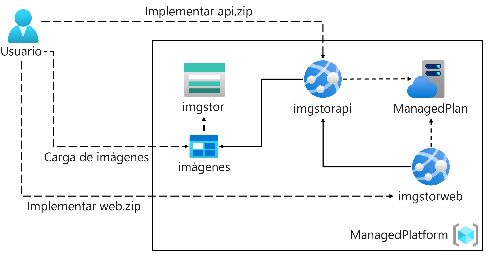

---
document:
  az204Class: 'Clase 2'
  az204Title: 'Módulo 1: Crear aplicaciones web con Azure App Service'
---

# Clase 2

## Diagrama de arquitectura



## Creación del ambiente para el laboratorio

1. Autenticación con Azure CLI

    ```pwsh
    az login
    ```

1. Variables a utilizar

    ```pwsh
    $resourceGroup="educacionit-clase02"
    ```

1. Crear un nuevo grupo de recursos
    ```pwsh
    az group create -n $resourceGroup -l EastUs2

    az group list -o table
    ```

### Grupo de recursos para los laboratorios

1. Crear un nuevo grupo de recursos
    ```pwsh
    az group create -n educacionit-clase02 -l EastUs2
    ```
1. Crear Plan de App Service
    ```pwsh
    az appservice plan create -g educacionit-clase02 -n app-plan-educacionit-class02 --sku F1
    ```

### Nueva cuenta de almacenamiento

1. Directorio de trabajo
    ```pwsh
    cd labs/class02/img
    ```
1. Crear la cuenta de almacenamiento
    ```pwsh
    az storage account create -g educacionit-clase02 -n educacionitclass02 --sku Standard_LRS --access-tier Hot --min-tls-version TLS1_2 --public-network-access Enabled --routing-choice MicrosoftRouting
    ```
1. Obtener la cadena de conexion a la cuenta de almacenamiento creada
    ```pwsh
    $connectionString=az storage account show-connection-string -n educacionitclass02 -g educacionit-clase02 --query connectionString -o tsv
    ```
1. Crear el blob de contenedor de imagenes con acceso publico
    ```pwsh
    az storage container create -n images --public-access blob --connection-string $connectionString
    ```
1. Subir imagen de ejemplo al blob del contenedor
    ```pwsh
    az storage blob upload -c images -f ./sub.jpg -n sub.jpg --connection-string $connectionString

    az storage blob upload -c images -f ./blt.jpg -n blt.jpg --connection-string $connectionString
    ```

### Nueva aplicacion Web API

1. Directorio de trabajo
    ```pwsh
    cd labs/class02/Api
    ```
1. Crear WebApp en App Service
    ```pwsh
    az webapp create -g educacionit-clase02 -n webapp-api-educacionit -p app-plan-educacionit-class02 -r "dotnet:6"
    ```
1. Agregar configuraciones para la construccion del sitio .NET durante el despliegue
    ```pwsh
    az webapp config appsettings set -g educacionit-clase02 -n webapp-api-educacionit --settings SCM_DO_BUILD_DURING_DEPLOYMENT=true

    az webapp config appsettings set -g educacionit-clase02 -n webapp-api-educacionit --settings StorageConnectionString=$connectionString
    ```
1. Despligue de la aplicacion desde el directorio de desarrollo
    ```pwsh
    az webapp up -g educacionit-clase02 -n webapp-api-educacionit -p app-plan-educacionit-class02 -r "dotnet:6"
    ```

### Nueva aplicacion Web con consulta a Web API

1. Directorio de trabajo
    ```pwsh
    cd labs/class02/Web
    ```
1. Crear WebApp en App Service
    ```pwsh
    az webapp create -g educacionit-clase02 -n webapp-api-sync-educacionit -p app-plan-educacionit-class02 -r "dotnet:6"
    ```
1. Agregar configuraciones para la construccion del sitio .NET durante el despliegue
    ```pwsh
    az webapp config appsettings set -g educacionit-clase02 -n webapp-api-sync-educacionit --settings SCM_DO_BUILD_DURING_DEPLOYMENT=true

    az webapp config appsettings set -g educacionit-clase02 -n webapp-api-sync-educacionit --settings ApiUrl=https://webapp-api-educacionit.azurewebsites.net/
    ```
1. Despligue de la aplicacion desde el directorio de desarrollo
    ```pwsh
    az webapp up -g educacionit-clase02 -n webapp-api-sync-educacionit -p app-plan-educacionit-class02 -r "dotnet:6"
    ```

### Uso de Key Vault para la administracion de configuracion de las aplicaciones

1. Creacion del Key Vault
    ```pwsh
    az keyvault create -g educacionit-clase02 -n kv-clase02 -l EastUs2 --sku Standard --retention-days 90 --enable-rbac-authorization false --public-network-access Enabled
    ```
1. Crear un secreto para la cadena de conexion de la cuenta de almacenamiento
    ```pwsh
    az keyvault secret set -n StorageAccount --vault-name kv-clase02 --value $connectionString
    ```
1. Crear un secreto para la URL del Web API
    ```pwsh
    az keyvault secret set -n BackendUrl --vault-name kv-clase02 --value https://webapp-api-educacionit.azurewebsites.net/
    ```
1. Habilitar la asignacion de permisos de identidad hacia ambos sitios
    ```pwsh
    az webapp identity assign -g educacionit-clase02 -n webapp-api-educacionit

    az webapp identity assign -g educacionit-clase02 -n webapp-api-sync-educacionit
    ```
1. Obtener el ID de la aplicacion Web API
    ```pwsh
    $apiPrincipalId=az webapp identity show -n webapp-api-educacionit -g educacionit-clase02 --query "principalId" -o tsv
    ```
1. Obtener el ID de la aplicacion Web
    ```pwsh
    $systemPrincipalId=az webapp identity show -n webapp-api-sync-educacionit -g educacionit-clase02 --query "principalId" -o tsv
    ```
1. Configurar el acceso a los secretos segun cada la aplicacion
    ```pwsh
    az keyvault set-policy -n kv-clase02 --secret-permissions get list --object-id $apiPrincipalId

    az keyvault set-policy -n kv-clase02 --secret-permissions get list --object-id $systemPrincipalId
    ```
1. Modificar el valor de la configuracion del Web API
    ```pwsh
    az webapp config appsettings set -g educacionit-clase02 -n webapp-api-educacionit --settings "StorageConnectionString=@Microsoft.KeyVault(SecretUri=https://kv-clase02.vault.azure.net/secrets/StorageAccount)"
    ```
1. Modificar el valor de la configuracion del sitio Web conectado a Web API
    ```pwsh
    az webapp config appsettings set -g educacionit-clase02 -n webapp-api-sync-educacionit --settings "ApiUrl=@Microsoft.KeyVault(SecretUri=https://kv-clase02.vault.azure.net/secrets/BackendUrl)"
    ```

### Eliminacion de los laboratorios

1. Eliminacion del grupo de recursos
    ```pwsh
    az group delete -n educacionit-clase02 --no-wait
    ```
